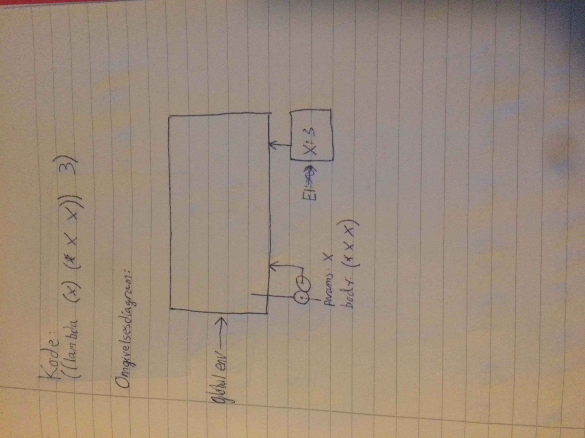
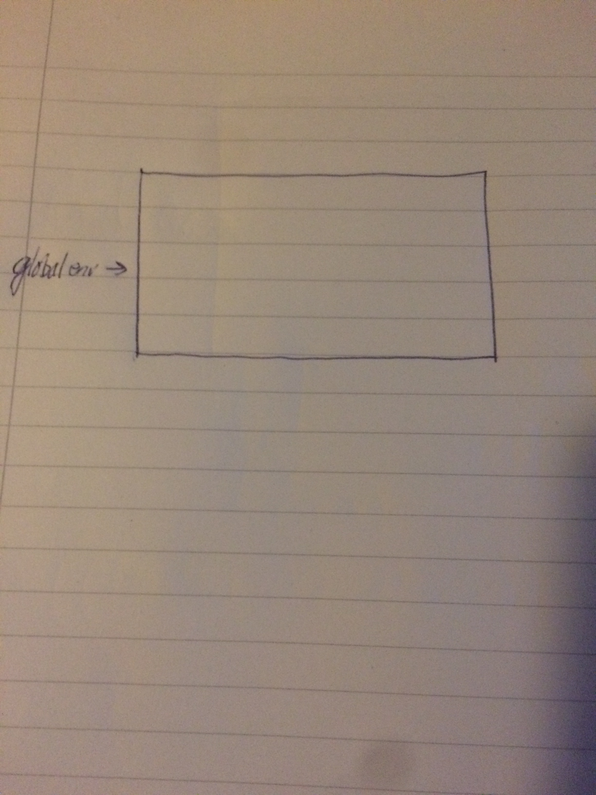

# Time 9 - 23.03.17
Denne timen ser vi endel på omgivelsesdiagram (pga at dette er superrelevant for oblig 2b!). Vegard (gruppelærer for gruppe 3) har allerede laget en utfyllende guide for omgivelsesdiagram, som dere kan finne på [hans github repo for kurset](https://github.com/vegarsti/INF2810V17/tree/master/08). Under vil jeg ta et eksempel på hvordan vi tegner anonyme prosedyrer. 

## Omgivelsesdiagram for anonyme prosedyrer
Vi tar utganspunkt i `square`-prosedyren vi har sett på tidligere (gange et tall med seg selv), men denne gangen som en anonym prosedyre. F.eks `((lambda (x) (* x x)) 3)`. Idet kallet på denne utføres vil omgivelsesdiagrammet se slik ut:

Dette pga at hver gang en prosedyre anvendes, så vil vi få en ny ramme. Merk at prosedyren også er tegnet som vanlig med de to sirklene, men uten et navn den er bundet til. Etter kallet er uførst vil både dette miljøet og prosedyren forsvinne, og vi vil få

Dette vil også være tilstanden før prosedyren kalles.
